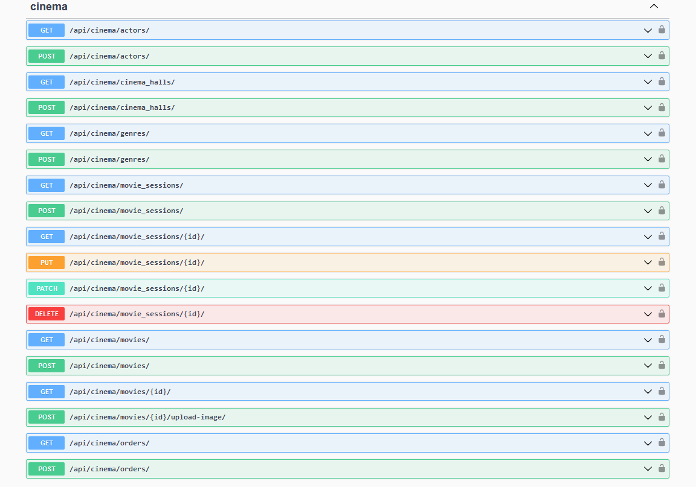
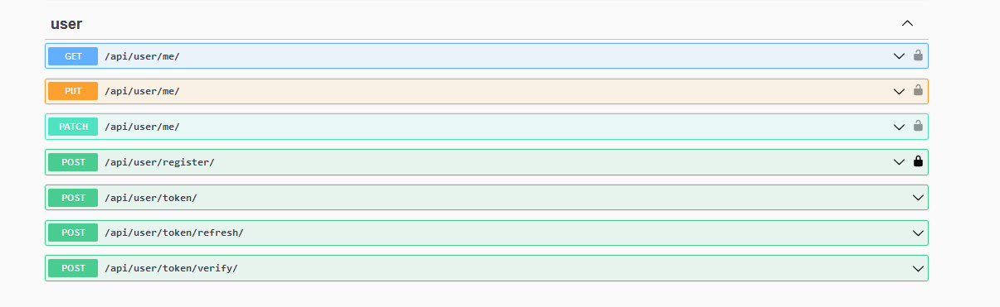
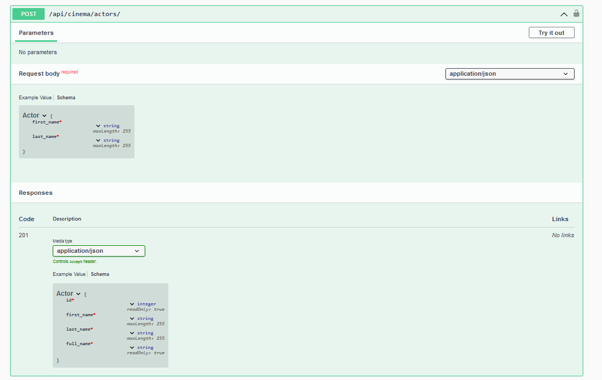

# cinema-API
**Cinema API** is an API service for cinema management, written using the Django Rest Framework (DRF). 
It allows you to manage various aspects of a cinema, including creating and managing movies, cinema halls,
movie sessions, orders, and tickets.

### Installation
#### To install Cinema API using GitHub, follow these steps:

- Install PostgreSQL and create a database.
- Clone the repository by running the following command:<br>
  ```bash
  git clone https://github.com/ZabFTFT/cinema-API.git
  ```
- Change to the cloned repository directory by running:<br>
    ```bash
  cd cinema-api
  ```
- Create a new virtual environment by running:<br>
    ```bash
   python -m venv venv
   ```
- Activate the virtual environment by running:<br>
    ```bash
   Windows: venv\Scripts\activate
  
   Linux/MacOs: source venv/bin/activate
  ```
- Install the required packages by running:<br>
    ```bash
   pip install -r requirements.txt
   ```
- Set the required environment variables in .env file(use .env.sample) **OR**
- Set the required environment variables by running the following commands:<br>
   ```bash
  For Windows: use <set> <env_variable>
  
   set DB_HOST=YOUR_DB_HOSTNAME
   set DB_NAME=YOUR_DB_NAME
   set DB_USER=YOUR_DB_USER
   set DB_PASSWORD=YOUR_DB_PASSWORD
   set DB_SECRET_KEY=YOUR_SECRET_KEY
   set DJANGO_SECRET_KEY=DJANGO_SECRET_KEY
   set ALLOWED_HOSTS=ALLOWED_HOSTS
   set DEBUG=DEBUG
  ```
     ```bash
  For Linux/MacOS: use <export> <env_variable>
  
   export DB_HOST=YOUR_DB_HOSTNAME
   export DB_NAME=YOUR_DB_NAME
   export DB_USER=YOUR_DB_USER
   export DB_PASSWORD=YOUR_DB_PASSWORD
   export DB_SECRET_KEY=YOUR_SECRET_KEY
   export DJANGO_SECRET_KEY=DJANGO_SECRET_KEY
   export ALLOWED_HOSTS=ALLOWED_HOSTS
   export DEBUG=DEBUG
  ```
- Apply the database migrations by running:<br>
    ```bash
   python manage.py migrate
   ```
- Start the development server by running:<br>
    ```bash
   python manage.py runserver
   ```

#### Alternatively, you can run Cinema API using Docker:
- Install Docker.
- Clone the repository and change to the cloned repository directory.
- Build the Docker image by running:<br>
    ```bash
    docker-compose build
  
    docker-compose up
    ```
### Getting Access 
- To get access to Cinema API, you need to create a user account and <br>
 obtain an access token.
- Create a new user by sending a POST request to /api/user/register/<br>
 with the required user details in the request body.
- Obtain an access token by sending a POST request to /api/user/token/ <br>
with the user's email and password in the request body.

### Features
- JWT authentication
- Admin panel at /admin/
- API documentation at /api/doc/swagger/
- Management of orders and tickets
- Creation of movies with genres and actors
- Creation of cinema halls
- Addition of movie sessions
- Filtering of movies and movie sessions

### Demo


